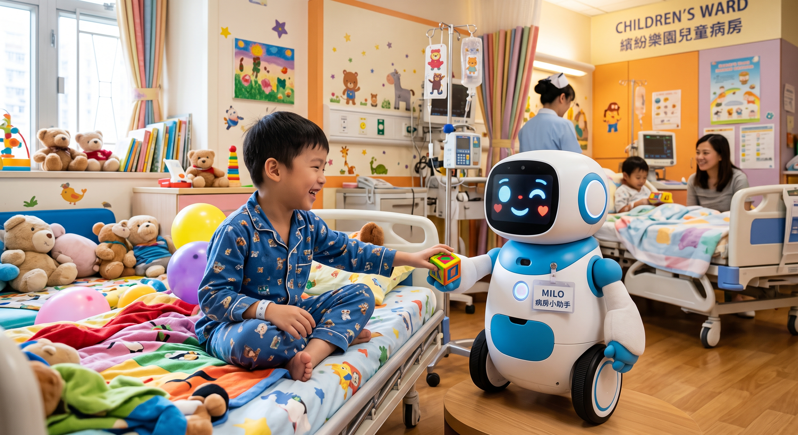
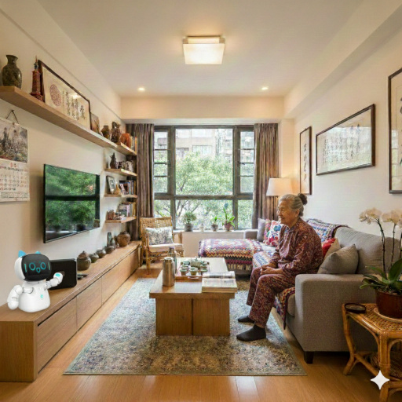
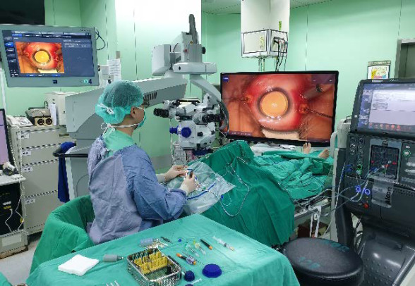
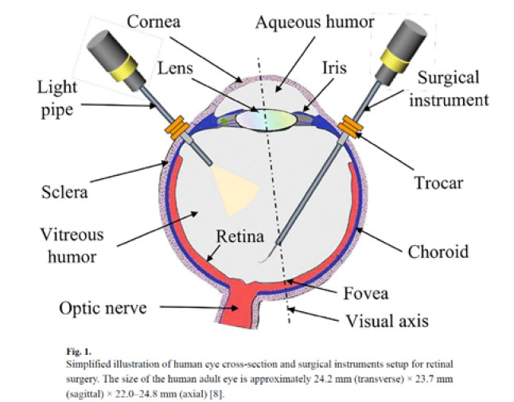
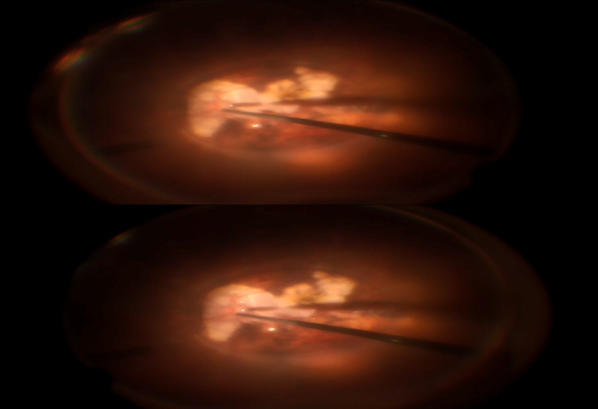

<h3 class="fw-bold">Current Projects</h3>

#### Embodying Cognitive Intelligence in Care Robots

This is a multi-year, integrated project funded by the NSTC, aiming to develop the embodied cognitive Intelligence in care robots. We are in charge of the Sub-project 2: sensing capability. Our primary scenario is a pediatric ward in a hospital. We expect our robot to automnomously and seamlessly interact with children, in particular to distract them from pain after surgery.

#### Solo Senior Watch Robot

This project is funded by NSTC, aiming to develop a social robot program as a watchdog to serve solo seniors at home. There are two primary goals in this project. The first goal is to actively detect  emergency cases and contact care providers. The second is to detect home intruders.

[Project GitHub repository](https://github.com/yangchihyuan/SoloSeniorWatchRobot)

#### Robot Nurse Helper
<iframe width="560" height="315" src="https://www.youtube.com/embed/gl8OrY62YNc?si=JDJkF0hzykJIhrGb" title="YouTube video player" frameborder="0" allow="accelerometer; autoplay; clipboard-write; encrypted-media; gyroscope; picture-in-picture; web-share" referrerpolicy="strict-origin-when-cross-origin" allowfullscreen></iframe>

<iframe width="560" height="315" src="https://www.youtube.com/embed/ikdxW6pdx94?si=VQ7lZI4rRSysHm5d" title="YouTube video player" frameborder="0" allow="accelerometer; autoplay; clipboard-write; encrypted-media; gyroscope; picture-in-picture; web-share" referrerpolicy="strict-origin-when-cross-origin" allowfullscreen></iframe>

This is a project to develop an interactive robot desktop multimedia system to deliver health education in hospitals to alleviate the shortage of nurse educator in Taiwan. We collaborate with an ophthalmologist at Chang Gung Memorial Hospital to develop the content and control flow for cataract patients for their pre- and post-surgical health education.
Code is available on my GitHub webpage [(Link)](https://github.com/yangchihyuan/RobotNurseHelper).

#### Depth Estimation in an Eye Ball
<iframe width="560" height="315" src="https://www.youtube.com/embed/5K5XpxEGqus?si=4NuJfTuDyljWDS5Q" title="YouTube video player" frameborder="0" allow="accelerometer; autoplay; clipboard-write; encrypted-media; gyroscope; picture-in-picture; web-share" referrerpolicy="strict-origin-when-cross-origin" allowfullscreen></iframe>

For intraocular microsurgery, robotic assistance is a cutting-edge research field because it is promising for expanding human capabilities and improving the safety and efficiency of the intricate surgery process. Because depth is critical for intraocular microsurgery, in this project we want to estimate the depth of the medical devices in an eye ball. We want to develop a method which can warm the operator if the device is too close to the retina.
