For international students who are interested in our AI Master's program and co-working with me, please take a look at the official page about [CGU Scholarship Info](https://www.cgu.edu.tw/recruit_intl/Contents?nodeId=17605). If you want to get the fully-sponsored-by-CGU scholarship, you have to apply in the 1st session, whether for the fall or the spring semester. Usually, there are 2 to 3 slots for the fall semester and 1 to 2 for the spring semester, and no slot will remain in the second application session.
Thus, please consider the [Taiwan Scholarship Program](https://taiwanscholarship.moe.gov.tw/web/index.aspx). If you get the MOE scholarship, you no longer need a CGU scholarship. If you are living in a developing country, you may be qualified for the [Taiwan ICDF scholarship](https://www.icdf.org.tw/wSite/np?ctNode=31561&mp=2&gad_source=1&gad_campaignid=14397109098&gbraid=0AAAAABNPMbuVyu00vwa1HaXPv_iEI9Ws_&gclid=Cj0KCQjwzY7VBhDwARIsAFtPvBQ1wUWUVpKvl-yc6OrkY5KngJOd-LIKEXF02mEVwOJz6WeEneFzRVgaAhX_EALw_wcB).
There is no separate application form or page for the fully-sponsored-by-CGU scholarship. When you fill out your Master's program application form, simply mark the checkbox "I want to apply for the CGU scholarship", and you will automatically be included in a ranking list. The list is determined by our department's chair and international admission committee. If you are ranked as #1, #2, or #3 (depending on the quota), you will be awarded the scholarship.
Regarding the fully-sponsored-by-supervisor-and-CGU scholarship (RA scholarship), if you can find a professor in our department who is willing to hire you as an RA for 24 months, you can get this scholarship to waive your tuition fee. Until now, CGU freely provide dormitory for international Master's students.

#### 
Professor

| 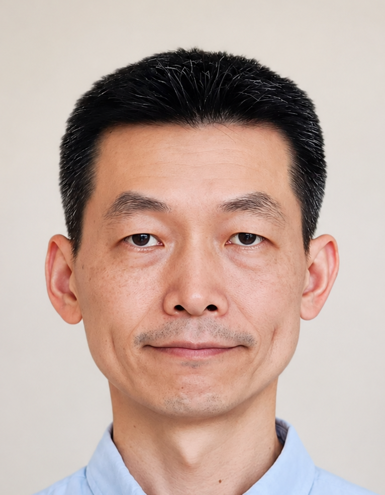|
|:---:|
|Chih-Yuan Yang|
|楊智淵|

#### 
Ph.D. Student

|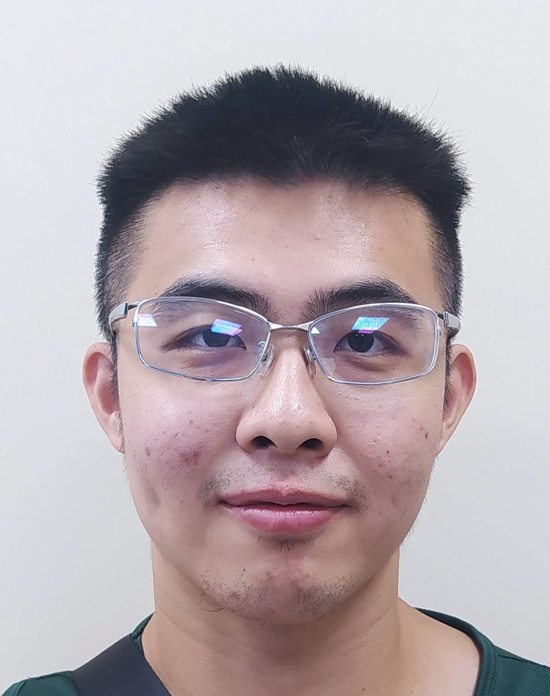|
|:---:|
|Brian Liu|
|劉冠亨|
|[Personal Page](people/Brian_Liu/Brian_Liu.md)|

#### 
Master's Students

|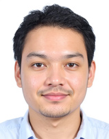|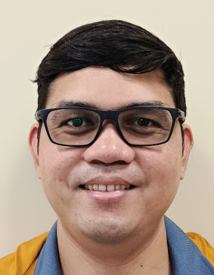|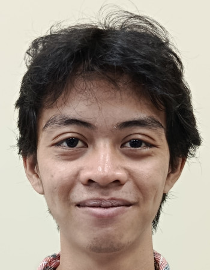|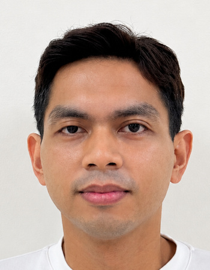|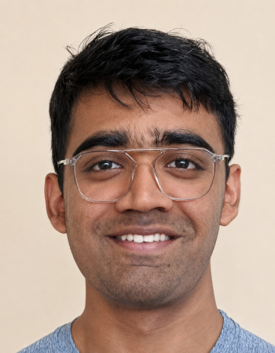|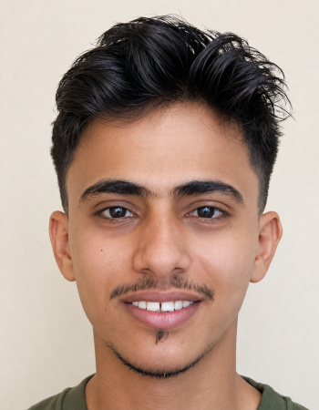|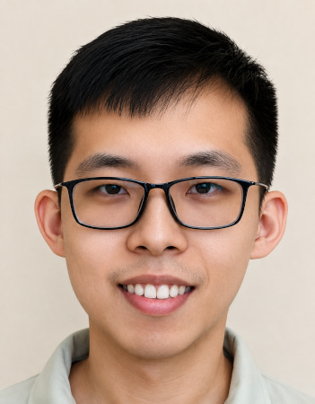|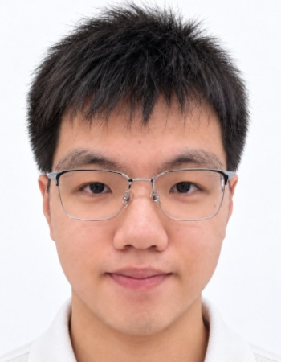|
|:---:|:---:|:---:|:---:|:---:|:---:|:---:|:---:|
|Kan Tippayamontri|Niño Jhanus Aniban|Luigi Thoriq Kholis|John Astronomo Bacus|Vedant Vilas Bijwe|Ahmed Alghaili|Jonathan Tanuwijaya|Han-Tse_Kuo|
|กานต์ ทิพยมนตรี||||वेदांत विलास बिजवे|أحمد الغيلي||郭瀚澤|
|[Personal Page](people/Kan_Tippayamontri/Kan_Tippayamontri.md)|[Personal Page](people/Niño_Jhanus_Aniban)|[Personal Page](people/Luigi_Thoriq_Kholis)|[Personal Page](people/John_Astronomo_Bacus)|[Personal Page](people/Vedant_Vilas_Bijwe)|[Personal Page](people/Ahmed_Alghaili)|[Personal Page](people/Jonathan_Tanuwijaya)|[Personal Page](people/Han-Tse_Kuo/Han-Tse_Kuo.md)|

#### 
Capstone Students

||
|:---:|
|Eric Chen|
|陳毅|
|[Personal Page](people/Eric_Chen)|

|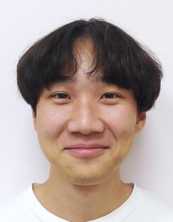|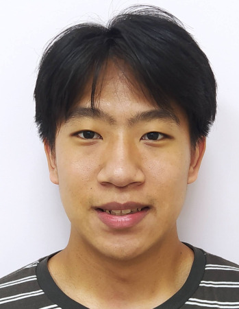|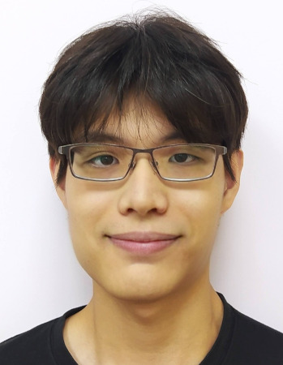|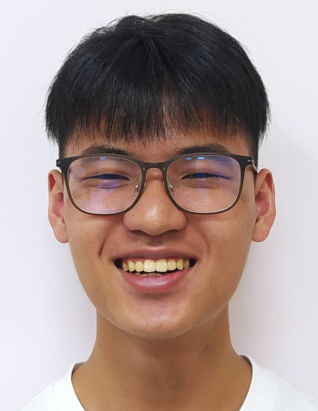|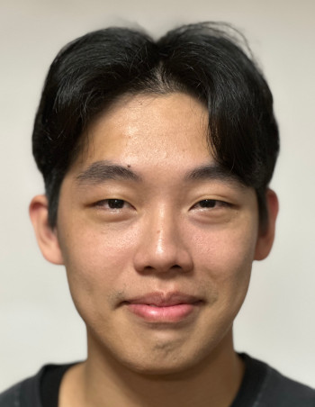|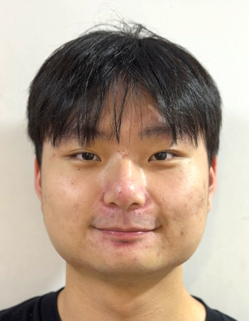|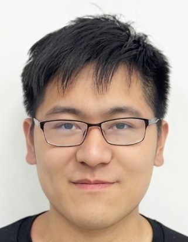|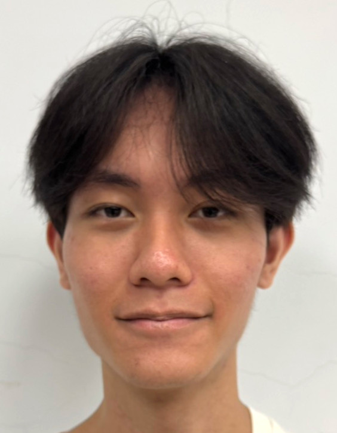|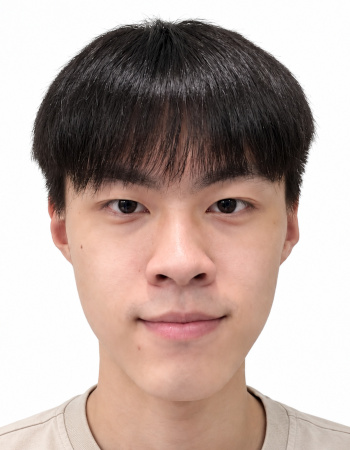||||
|:---:|:---:|:---:|:---:|:---:|:---:|:---:|:---:|:---:|:---:|:---:|:---:|
|Justin Chang|Eric Peng|Eathen Weng|Peter Chen|Yi-Cheng Ethan Fang|Le-Chi Hu|Ian Luo|Hao-Cheng Joseph Yang|Eric Sung||||
|張喬翔|彭冠維|翁宇陽|陳威誠|方翊丞|胡樂麒|羅立安|楊皓丞|宋柏諭|劉韋彤|陳冠穎|黃栢碩|
[Personal Page](people/Justin_Chang)|[Personal Page](people/Eric_Peng/Eric_Peng.md)|[Personal Page](people/Eathen_Weng)|[Personal Page](people/Peter_Chen)|[Personal Page](people/Yi-Cheng_Fang/Yi-Cheng_Fang.md)|[Personal Page](people/Le-Chi_Hu/Le-Chi_Hu.md)|[Personal Page](people/Ian_Luo/Ian_Luo.md)|[Personal Page](people/Hao-Cheng_Yang/Hao-Cheng_Yang.md)|[Personal Page](people/Eric_Sung/Eric_Sung.md)||||

|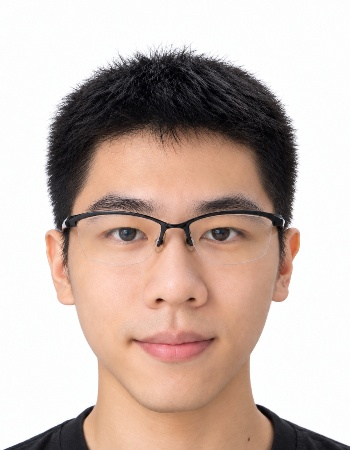|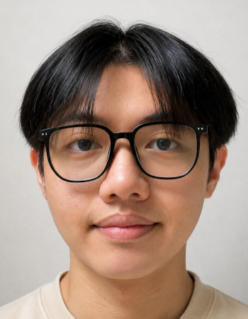|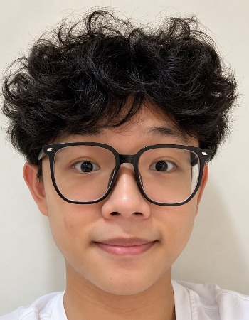|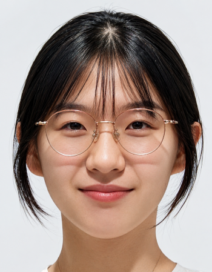|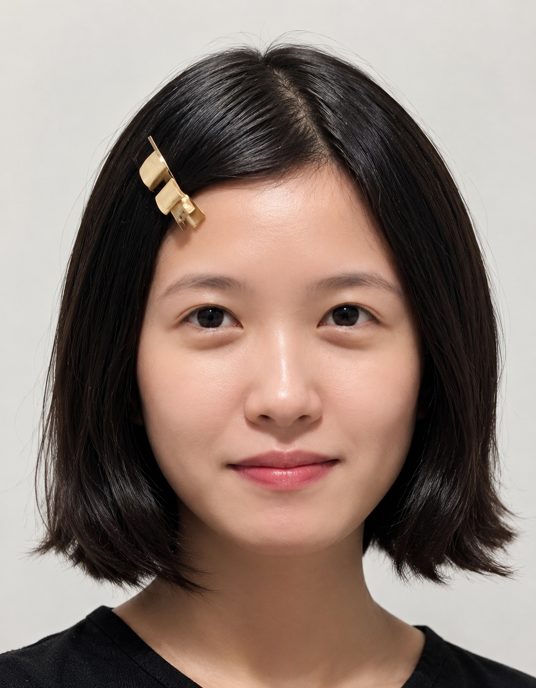|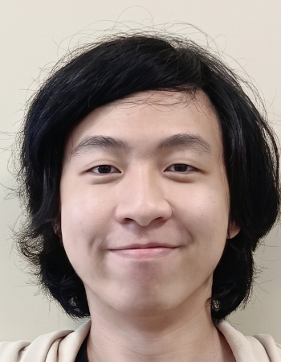|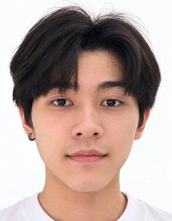|
|:---:|:---:|:---:|:---:|:---:|:---:|:---:|
|Sam Jiang|Kevin Wu|Anderson Yeh|Joy Hong|Angel Wu|Bill Po-Yu Chou|Chao-an Shih|
|姜柏任|吳宜祐|葉方奕|洪子貽|吳雨蓁|周柏宇|施兆恩|
|[Personal Page](people/Sam_Jiang)|[Personal Page](people/Kevin_Wu/Personal_Info)|[Personal Page](people/Anderson_Yeh/Anderson_Yeh.md)|[Personal Page](people/Joy_Hong)|[Personal Page](people/Angel_Wu)|[Personal Page](people/Bill_Po-Yu_Chou)|[Personal Page](people/Chao-an_Shih/Personal_Info)|

#### 
2026 TEEP Students

|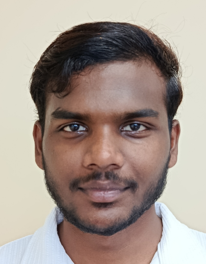|
|:---:|
|Karthikeyan Palani Murugan|
|कार्तिकेय पलानी मुरुगन|
|[Personal Page](people/Karthikeyan_Palani_Murugan)|  

#### 
Alumni

||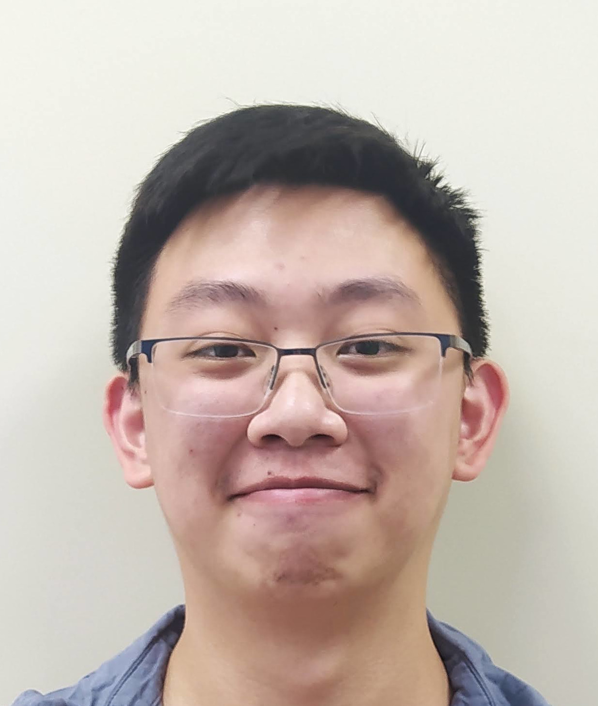|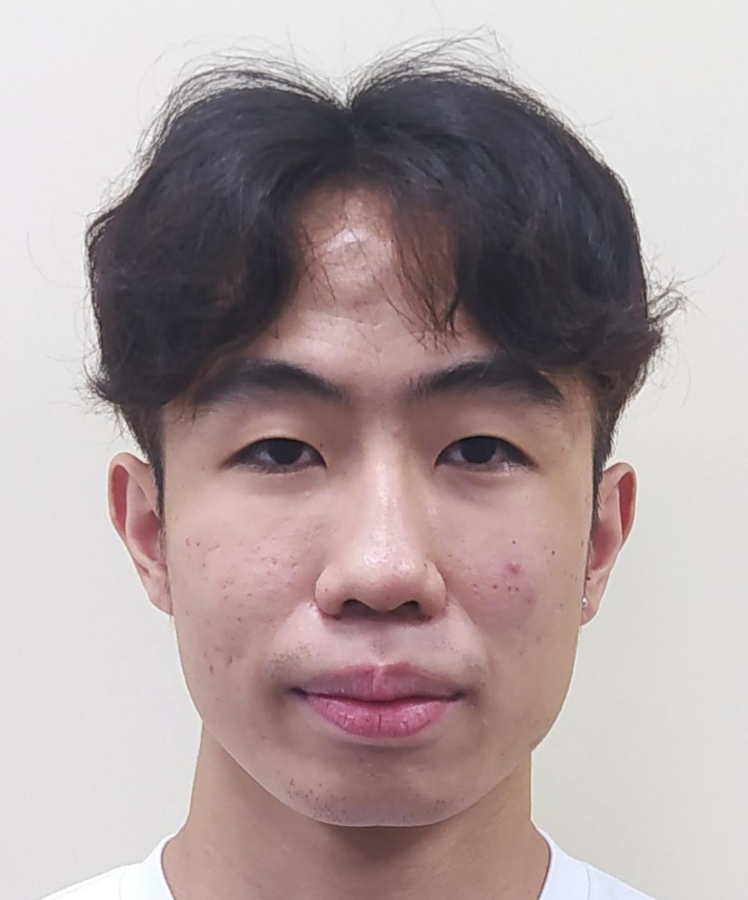|
|:---:|:---:|:---:|
|Brian Liu|Wayne Tsai|Eric Lu|
|劉冠亨|蔡承原|盧睿霆|
|[Personal Page](people/Brian_Liu/Brian_Liu.md)|[Personal Page](people/Wayne_Tsai/Wayne_Tsai.md)|[Personal Page](people/Eric_Lu/Eric_Lu)|

#### 
Former Visiting Students

|||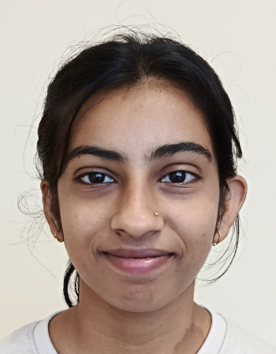|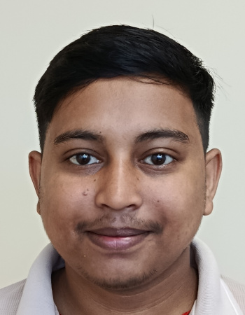|
|:---:|:---:|:---:|:---:|
|Mohamed Elsayed|Rachael Zehrung|Shruti Kumari Jaiswal|Shiv Kumar Gupta|
|محمد السيد||रुति कुमारी जयसवाल|शिव कुमार गुप्ता|
|[Personal Page](https://www.linkedin.com/in/mohamed-elsayed-53269624a/)|[Personal Page](https://www.rzehrung.name/)|[Personal Page](people/Shruti_Kumari_Jaiswal/Shruti_Kumari_Jaiswal.md)|[Personal Page](people/Shiv_Kumar_Gupta/Shiv_Kumar_Gupta.md)|

#### 
Former Capstone Student

| |
|:---:|
|Matt Wu|
|吳奕廷|
|[Personal Page](people/Matt_Wu)|
