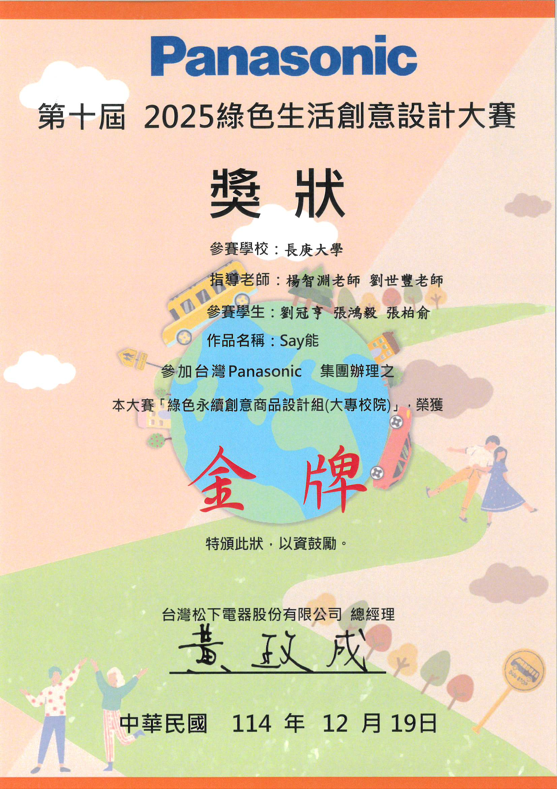
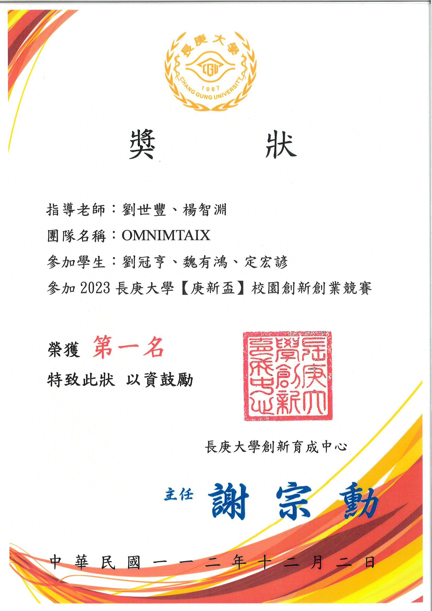

#### Publication

Guan-Heng Liu, Chin-Ling Li, Chih-Yuan Yang, and Shih-Feng Liu (2025). Development and Validation of a Novel AI-Derived Index for Predicting COPD Medical Costs in Clinical Practice. Computational and Structural Biotechnology Journal 20250201 Vol.27 [https://doi.org/10.1016/j.csbj.2025.01.015](https://doi.org/10.1016/j.csbj.2025.01.015).

#### Thesis

開發並驗證一項新穎人工智慧衍生指數以預測慢性阻塞性肺 病醫療成本：臨床實證研究 [pdf](https://www.dropbox.com/scl/fi/cbowil6uq75vvoyq4ah65/Thesis_BrianLiu2025.pdf?rlkey=c96250zgalsglkj6d4fg3vi99&dl=0)

#### Awards

114學年度教育部UStart創業競賽第二階段績優，獎金75萬元

114學年度教育部UStart創業競賽第一階段績優，獎金20萬元

2025 Panasonic 綠色生活創意設計大賽 金獎

2024 Panasonic 綠色生活創意設計大賽 銅獎

112學年度庚新盃創業競賽第一名

#### Contact

Email: m1261003@cgu.edu.tw

---