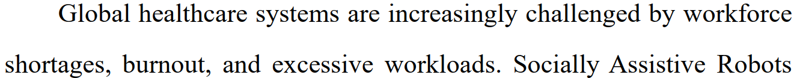

# 1 Poor translation

This English abstract is translated from its Chinese version using a LLM, but it becomes very difficult to read.

Suggested solution: Ask a native speaker to rewrite the entire abstract.

# 2 Irrelevant content

