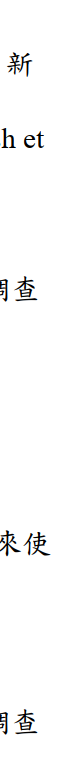
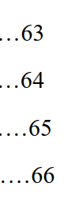
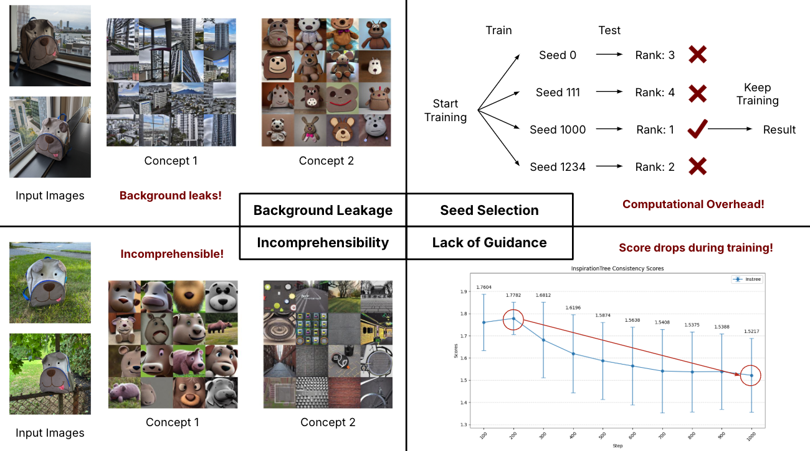

# 1 Poor translation
"Global healthcare systems are increasingly challenged by workforce shortages, burnout, and excessive workloads. Socially Assistive Robots (SARs) have emerged as a potential solution. Although SARs have demonstrated potential in pediatric care, existing research has largely concentrated on technological development or patient-centered perspectives, with insufficient focus on the experiences and professional insights of frontline healthcare providers."

This English abstract is translated from its Chinese version using a translation tool.

"隨著全球醫療體系面臨人力短缺、職業倦怠與工作負荷過重等挑戰，社交輔助機器人（Socially Assistive Robots, SARs）在臨床照護中的應用逐漸受到關注。雖然 SARs 在兒科醫療中展現潛力，但現有研究多聚焦於機器人發展的技術面或病患觀點，缺乏對第一線醫護人員經驗與專業角色看法的深入探討，並且多數研究缺乏理論依據以及實際使用的經驗。"

However, the translated English sentences become very difficult to read.

Advice: Find a native speaker to rewrite those sentences.

# 2 Irrelevant content
  

The icon at the bottom right corner is irrelevant.

Advice: Remove it.

# 3 Wrong alignment settings

Advice: Use justified rather than align left.

# 4 acronym 

## 4.1 Incorrect case 

It should be DOSE.

## 4.2 Incorrect full name location

The full name of GOLD should be shown when the acronym is first used in the thesis. 

# 5 Inconsistency

## 5.1 Inconsistent indentation

Advice: Paragraphs at the same level should have the same indentation.

## 5.2 Inconsistent font size

The (Luo et al., 2020) is smaller than other words.

## 5.3 Inconsistent fullwidth and halfwidth characters

This is a Chinese sentence and every character is fullwidth, but the ending period becomes halfwidth.

The first pair of parentheses is fullwidth, but the second is halfwidth.

## 5.4 Inconsistent language

The table of content is in Chinese, but the term References is in English.

Advice: Change Reference to 文獻摘要.

## 5.5 Inconsistent reading direction

The bottom-right region needs to be read from right to left, which is inconsistent with the other three regions in this figure.

Revised:

# 6 References

## 6.1 Wrong expression of the author names
  
  

All author names are wrong. 

## 6.2 Double periods

It is impossible to have double periods at the end.

Advice: This is an example of a well formatted references. Extracted from Luo L, Li J, Lian S, Zeng X, Sun L, Li C, Huang D, Zhang W. Using machine learning approaches to predict high-cost chronic obstructive pulmonary disease patients in China. Health Informatics J. 2020 Sep;26(3):1577-1598. doi: 10.1177/1460458219881335.
  

