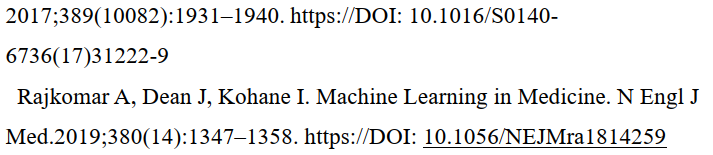

# Overall advice
If you want to use Microsoft Word to write your thesis, you had better know how to operate Word's styles settings, which can help save you adjusting sentences one by one.

If you use LaTeX to render your thesis, the benefit is that most formats are well defined and you can focus on the content. However, you need to spend effort on learning LaTeX syntax and being familiar with used packages. Unlike MS Word, which has a built-in grammar and spell checker, most LaTeX editors don't have those. Thus, you should install a writing assistant tool such as Grammarly, which supports LaTeX files even for the free edition. Grammarly will give you many hints of possible typos and grammatically mistakes. If you use Overleaf to edit your LaTeX file, Overleaf has a built-in writing assistant tool Writefull, which is similar to Grammarly. If you prefer Grammarly, here is the [instruction](https://www.overleaf.com/learn/how-to/Use_Grammarly_with_Overleaf) to use Grammarly on Overleaf.

# Checklist

<a href="#1-inconsistency">1 Inconsistency</a>

<a href="#11-inconsistent-indentation">1.1 Inconsistent indentation</a> 

<a href="#12-inconsistent-font-size">1.2 Inconsistent font size</a>

<a href="#13-inconsistent-fullwidth-and-halfwidth-characters">1.3 Inconsistent fullwidth and halfwidth characters</a>

<a href="#14-inconsistent-language">1.4 Inconsistent language</a>

<a href="#15-inconsistent-reading-direction">1.5 Inconsistent reading direction</a>

<a href="#16-inconsistent-blank">1.6 Inconsistent blank</a>

<a href="#17-inconsistent-font">1.7 Inconsistent font</a>

<a href="#18-inconsistent-numbering-format">1.8 Inconsistent numbering format</a>

<a href="#19-inconsistent-case">1.9 Inconsistent case</a>

<a href="#110-inconsistent-underline">1.10 Inconsistent underline</a>

<a href="#111-inconsistent-bullet">1.11 Inconsistent bullet</a>

<a href="#2-format">2 Format</a>

<a href="#21-wrong-alignment-setting">2.1 Wrong alignment setting</a>

<a href="#22-improper-indentation">2.2 Improper indentation</a>

<a href="#23-forget-to-explain-an-acronym">2.3 Forget to explain an acronym</a>

<a href="#24-unreasonable-bold-type">2.4 Unreasonable bold type</a>

<a href="#25-unreasonable-large-number-of-decimal-places">2.5 Unreasonable large number of decimal places</a>

<a href="#26-missing-parentheses-blank">2.6 Missing parentheses blank</a>

<a href="#27-hanging-punctuation">2.7 Hanging Punctuation</a>

<a href="#3-references">3 References</a>

<a href="#31-wrong-expression-of-the-author-names">3.1 Wrong expression of the author names</a>

<a href="#32-double-periods">3.2 Double periods</a>

<a href="#33-wrong-case">3.3 Wrong case</a>

<a href="#34-missing-conference-or-journal">3.4 Missing conference or journal</a>

<a href="#35-wrong-conference-name">3.5 Wrong conference name</a>

<a href="#4-acronym">4 Acronym</a>

<a href="#41-incorrect-case">4.1 Incorrect case</a>

<a href="#42-incorrect-full-name-location">4.2 Incorrect full name location</a>

<a href="#5-figure">5 Figure</a>

<a href="#51-resolution-too-low">5.1 Resolution too low</a>

<a href="#52-inadequate-caption">5.2 Inadequate caption</a>

<a href="#53-irrelevant-content">5.3 Irrelevant content</a>

<a href="#54-inconsistent-mathematical-font">5.4 Inconsistent mathematical font</a>

<a href="#55-text-too-small">5.5 Text too small</a>

<a href="#56-text-too-large">5.6 Text too large</a>

<a href="#57-unnecessary-colon">5.7 Unnecessary colon</a>

<a href="#6-grammar">6 Grammar</a>

<a href="#61-ambiguous-relative-pronoun-which">6.1 Ambiguous relative pronoun which</a>

<a href="#62-work-uncountable">6.2 Work uncountable</a>

<a href="#63-tense">6.3 Tense</a>

<a href="#64-wrong-skipped-subject">6.4 Wrong skipped subject</a>

<a href="#65-typo-and-missing-verb">6.5 Typo and missing verb</a>

<a href="#66-missing-article">6.6 Missing article</a>

<a href="#67-state-of-the-art">6.7 State-of-the-art</a>

<a href="#68-traditional">6.8 Traditional</a>

<a href="#7-table">7 Table</a>

<a href="#71-use-image">7.1 Use image</a>

<a href="#72-font-size-too-large">7.2 Font size too large</a>

<a href="#73-inconsistent-decimal-places">7.3 Inconsistent decimal places</a>

<a href="#74-improper-shading">7.4 Improper shading</a>

<a href="#75-exceed-margin">7.5 Exceed margin</a>

<a href="#76-unreasonably-wide-space">7.6 Unreasonably wide space</a>

<a href="#77-numbers-not-aligned">7.7 Numbers not aligned</a>

<a href="
<a href="#8-improper-translation">8 Improper translation</a>

<a href="#81-limitation-of-translation-software">8.1 Limitation of translation software</a>

<a href="#9-equation">9 Equation</a>

<a href="#91-fail-to-treat-equations-as-phrases">9.1 Fail to treat equations as phrases</a>

<a href="#92-exceed-right-margin">9.2 Exceed right margin</a>

<a href="#93-incorrect-colon">9.3 Incorrect colon</a>

# 1 Inconsistency

## 1.1 Inconsistent indentation

Advice: Paragraphs at the same level should have the same indentation.

## 1.2 Inconsistent font size

The (Luo et al., 2020) is smaller than other words.

## 1.3 Inconsistent fullwidth and halfwidth characters

This is a Chinese sentence and every character is fullwidth, but the ending period becomes halfwidth.

The first pair of parentheses is fullwidth, but the second is halfwidth.

## 1.4 Inconsistent language

The table of content is in Chinese, but the term References is in English.

Advice: Change Reference to 參考資料.

The thesis is written in Chinese, but the flow chart is written in English.

Advice: Redraw the flow chart.

## 1.5 Inconsistent reading direction

The bottom-right region needs to be read from right to left, which is inconsistent with the other three regions in this figure.

Revised:

## 1.6 Inconsistent blank

There is a missing blank between 3.8 and 倫理.

## 1.7 Inconsistent font

The fonts of 2.5 and 1. 2. are different. 

Advice: Unless you want to emphasize something different, use the same font.

## 1.8 Inconsistent numbering format
### 1.8.1 Number format

The two paragraphs are consecutive, but their numbering formats are different.

Advice: Make them consistent.

### 1.8.2 Arabic and Roman numerals 

It is inconsistent for GOLD 1 2 3 4 and GOLD II III.

### 1.8.3 Chinese and Arabic numerals

It is better to use the Chinese number 六 rather than the Arabic number 6.

### 1.8.4 New line format

The first set is a colon without a new line, and the second set is no colon with a new line.

## 1.9 Inconsistent case

"Feature Importance" is each word capitalized, but "loss reduction" is in lowercase.

## 1.10 Inconsistent underline

One DOI is underlined, but another is not.

## 1.11 Inconsistent bullet

They should be the same.

# 2 Format

## 2.1 Wrong alignment setting

Advice: Use justified rather than align left.

Advice: Use justified rather than align center.

## 2.2 Improper indentation

The indentation here is too small. A proper indentation is 2 characters for Chinese sentences.

## 2.3 Forget to explain an acronym

Here DALYs and DALY are used, but its full name is missing.

Advice: Change to (DALY: Disability-Adjusted Life Year)

## 2.4 Unreasonable bold type

I have no idea why some characters are suddenly in bold type.

Advice: Remove their bold setting.

## 2.5 Unreasonable large number of decimal places

Advice: Make them shorter and consistent.

## 2.6 Missing parentheses blank

This example shows a wrong format. In English sentences, there are always a blank before the left parenthesis and after the right parenthesis. 

## 2.7 Hanging Punctuation

It is caused by the Asian Typography setting in Microsoft Word.

Solution: uncheck the highlighted item in Microsoft Word.

# 3 References

This is an example of a well formatted references. Extracted from Luo L, Li J, Lian S, Zeng X, Sun L, Li C, Huang D, Zhang W. Using machine learning approaches to predict high-cost chronic obstructive pulmonary disease patients in China. Health Informatics J. 2020 Sep;26(3):1577-1598. doi: 10.1177/1460458219881335.
  

## 3.1 Wrong expression of the author names
  
  

All author names are wrong. 

## 3.2 Double periods

It is impossible to have double periods at the end.

## 3.3 Wrong case

It is ActivityNet rather than Activitynet. Don't just export .bib files from a paper portal use them. Those portals do not guarantee those .bib files are 100% correct.

## 3.4 Missing conference or journal

All the 6 items miss their conferences or journals. Don't just export .bib files from a paper portal use them. Those portals do not guarantee those .bib files are 100% correct. You need to manually check them.

## 3.5 Wrong conference name

It should be "in Proceedings of European Conference on Computer Vision" rather than "in Computer Vision - ECCV 2006". The more formal expression is "in Proceedings of the 9th European Conference on Computer Vision".

# 4 Acronym 

## 4.1 Incorrect case 

It should be DOSE.

The a should be in lower case because the letter A is not a part of the acronym.

## 4.2 Incorrect full name location

The full name of GOLD should be shown when the acronym is first used in the thesis. 

# 5 Figure
## 5.1 Resolution too low

The resolution is too low to clearly show characters.

Advice: Redraw this figure.

The resolution is so low that there are zigzag patterns on those characters' edges.

Advice: There are a few solutions. (1) Use LaTeX's TikZ package to draw a flow chart. (2) Export a PowerPoint slide into a very high-resolution raster image. Here is the [instruction](https://learn.microsoft.com/en-us/troubleshoot/microsoft-365-apps/powerpoint/change-export-slide-resolution). (3) Export a PowerPoint slide into a PDF file, and include the PDF file in your LaTeX file.

## 5.2 Inadequate caption

The correct format should be 圖一：AI模型建構邏輯與流程圖。It is incorrect to use a subsection number to index the caption.

## 5.3 Irrelevant content

The icon at the bottom right corner is irrelevant.

Advice: Remove it.

## 5.4 Inconsistent mathematical font

The font used in the source PowerPoint slide is Calibri, which is different from the regular math font in LaTeX equation: Italic Roman. As a results, it will make readers difficult to follow.

Advice: If you want to use PowerPoint to create your flow charts, install a PowerPoint add-in IquanaTex, which allows you to create LaTeX equations in PowerPoint.

This is an example.

## 5.5 Text too small

Rule of thumb: The character size in a figure should be as large as the one in the manuscript or the caption. Thus, the reader can easily read those characters.

## 5.6 Text too large

Similar as 5.5.

## 5.7 Unnecessary colon

Those colons are unnecessary. You should remove them.

# 6 Grammar
## 6.1 Ambiguous relative pronoun which

 Otsu’s method [24] is a widely used automatic threshold selection method for image binarization in computer vision applications, which determines the optimal threshold by maximizing the inter-class variance of pixel intensities. 

The author uses the which to infer to the main clause, but the which occurs after the noun "computer vision applications" and confuses readers.

## 6.2 Work uncountable

Chapter 2 provides a review of related research works.

Recent works have explored the use of LoRA [15] for this purpose by training two distinct low-rank adaptation modules: a style LoRA and a content LoRA.

Prior works [36, 39] have shown that attention maps naturally capture object layouts in an image.

All the three sentences are wrong. Work is countable only for "something such as a painting, play, piece of music etc that is produced by a painter, writer, or musician".

Advice: If you want to use a countable noun, use study.

## 6.3 Tense

Given that there are multiple cross-attention layers in Latent Diffusion Models with different resolutions (i.e. 64, 32, 16, 8), we will focus on the resolution 16 layer which has been proven to contains the most semantic information. [1, 4, 13] 

The future tense in unnecessary and confusing. It is neither a promise nor a plan. It is what you do in your study, so you should use simple present tense.

For our work, similar to InspirationTree, we are optimizing {vl, vr} but with a slightly different loss ...

The continuous tense is meaningless.

Advice: Use simple present tense.

## 6.4 Wrong skipped subject

When training a latent diffusion model, the optimization objective is ...

The subordinate clause's subject is skipped. According to grammar, its subject is the same as the one of the main clause. As a result, the full sentence becomes "When the optimization objective trains a latent diffusion model, the optimization objective is ...", which is wrong because an optimization objective won't train a model. It is we, humans, who can train a model.

When combined with transfer learning, performance improves dramatically from 25.21 dB with random initialization to 28.69 dB.

Performance won't be combined with transfer learning. This sentence is wrong.

## 6.5 Typo and missing verb

The verb is missing. will associated --> is associated.

Typo: informatopn --> information ; logitude --> longitude.

Advice: Use a writing assistant tool such as Grammarly or Writefull to scan the source LaTeX file.

## 6.6 Missing article

... represents the binarized smoothed attention map which will be used as mask in our purposed method.

Mask is countable so it should be "a mask".

Advice: Use a writing assistant tool such as Grammarly or Writefull to scan the source LaTeX file.

Experimental results on jaCappella dataset show that MP-HTDemucs achieves an average SI-SDRi of 28.69 dB on the test set. 

It should be "on the jaCappella dataset".

## 6.7 State-of-the-art

This is wrong because state-of-the-art is an adjective rather than a noun. You can say "Comparison with State-of-the-art Methods".

## 6.8 Traditional

Although traditional CNNs performed well in computer vision, their fixed regular sampled grid restricts their...

Traditional localization methods for moving vehicles, such as cars and drones rely on GPS satellites.

This is a common problem among Chinese native speakers because in Chinese the word traditional (傳統的) is a synonym of those words: existing (現有的), standard (標準的), regular (一般的), common (常見的). However, in English their meanings are different. Traditional has two meanings: (1) being part of the traditions of a country or group of people (特定國家或民族傳統的) (2) following ideas and methods that have existed for a long time, rather than doing anything new or different SYN conventional (遵循長久以來的想法或作法的，不帶任何新意或不同。同意詞：保守的).

# 7 Table
## 7.1 Use image

This is wrong. The newline symbols should not appear. You should create a real table rather than using an image instead.
A real table can be rendered elegantly, but an image will look burry when a large zooming factor is used.

## 7.2 Font size too large

The font size in the table is obviously larger than the one of the regular manuscript. If you don't have a special purpose, don't do it. It will confuse your readers.

Advice: Keep the font size in a table as large as the one of the regular manuscript.

## 7.3 Inconsistent decimal places

It is ugly. Please add 00 after the first place or round the three places into a single place. You had better make then consistent.

## 7.4 Improper shading

The shading removes the original vertical and horizontal lines and makes this table difficult to read.

## 7.5 Exceed margin

## 7.6 Unreasonably wide space

## 7.7 Numbers not aligned

# 8 Improper translation
## 8.1 Limitation of translation software
"Global healthcare systems are increasingly challenged by workforce shortages, burnout, and excessive workloads. Socially Assistive Robots (SARs) have emerged as a potential solution. Although SARs have demonstrated potential in pediatric care, existing research has largely concentrated on technological development or patient-centered perspectives, with insufficient focus on the experiences and professional insights of frontline healthcare providers."

This English abstract is translated from its Chinese version using a translation tool.

"隨著全球醫療體系面臨人力短缺、職業倦怠與工作負荷過重等挑戰，社交輔助機器人（Socially Assistive Robots, SARs）在臨床照護中的應用逐漸受到關注。雖然 SARs 在兒科醫療中展現潛力，但現有研究多聚焦於機器人發展的技術面或病患觀點，缺乏對第一線醫護人員經驗與專業角色看法的深入探討，並且多數研究缺乏理論依據以及實際使用的經驗。"

However, the translated English sentences are very difficult to read.

Advice: Find a native speaker to rewrite those sentences.

# 9 Equation
A equation is part of a sentence so you should treat it as a phrase.

## 9.1 Fail to treat equations as phrases
This is an example. Because it is a sentence with the subordinate clauses where, you need to have commas at the end of the two equations and no indentation before the where.

This is the revised expression. I highlight the difference in red.

## 9.2 Exceed right margin

Advice: Separate the equation into two lines. Here is the [Overleaf example](https://www.overleaf.com/learn/latex/Aligning_equations_with_amsmath).

## 9.3 Incorrect colon

The equation is part of the sentence. We need to treat as a sentence so there should be no colon.
